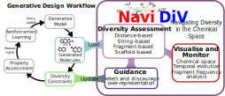

# NaviDiv: Chemical Diversity Monitoring for REINVENT4

**NaviDiv** is a framework for analysing and controlling chemical diversity during generative molecular design. It plugs into [REINVENT4](https://github.com/MolecularAI/REINVENT4) as a live diversity-penalty scoring component and ships a standalone Streamlit dashboard for post-hoc analysis.

[](https://doi.org/10.1039/D5DD00487J)
[](https://github.com/LCMD-epfl/NaviDiv)





## Features

NaviDiv provides six complementary diversity metrics:

| Scorer | What it measures |
|---|---|
| **Scaffold** | Bemis-Murcko scaffold diversity (wire-frame / framework variants) |
| **Ngram** | SMILES n-gram sequence-pattern diversity |
| **Fragments** | BRICS fragment-decomposition diversity |
| **Cluster** | Tanimoto-similarity cluster diversity |
| **RingScorer** | Ring-system diversity |
| **FGscorer** | Functional-group diversity |

All scorers can run standalone (app or script) or as live REINVENT4 penalty components during RL optimisation.

## Installation

Assumes REINVENT4 is already installed. Clone NaviDiv and install it into the same environment:

```bash
conda activate reinvent4
git clone https://github.com/mohammedazzouzi15/NaviDiv.git
cd NaviDiv
pip install -e .
```

Then set `NAVIDIV_ROOT` for the run scripts:

```bash
export NAVIDIV_ROOT="$(pwd)"
export PYTHONPATH="${PYTHONPATH}:${NAVIDIV_ROOT}/src/navidiv/reinvent"
```

## Usage

Two independent workflows are available — run either or both:

---

### A — Streamlit app: post-hoc diversity analysis

Explore generated molecules interactively. A bundled 200-molecule sample CSV is in `examples/app/sample_molecules.csv`.

**Option 1 — Streamlit dashboard:**

```bash
conda activate reinvent4
export NAVIDIV_ROOT=/path/to/NaviDiv
bash contrib/tutorials/NaviDiv/examples/app/run_app.sh
# Opens http://localhost:8501
# When prompted, load: contrib/tutorials/NaviDiv/examples/app/sample_molecules.csv
```

Recommended dashboard workflow:
1. **Load File** — enter the CSV path and click Load
2. **Run t-SNE** — 2D chemical-space projection
3. **Run individual scorers** — Scaffold, Ngram, Fragments, Cluster, …
4. **Run All Scorers** — full diversity report written to `scorer_output/`
5. **Per Step tab** — diversity trends over optimisation steps (requires `step` column)

**Option 2 — programmatic script (no browser):**

```bash
conda activate reinvent4
cd contrib/tutorials/NaviDiv/examples/app
python run_demo.py
# Prints diversity scores for all metrics and writes outputs to ./demo_output/
```

---

### B — REINVENT4 run: live diversity constraints during RL

Add diversity penalty components to a REINVENT4 staged-learning run. All configs and scripts are self-contained in `examples/reinvent/`.

**Quick test (10 steps, ~1 min):**

```bash
conda activate reinvent4
export NAVIDIV_ROOT=/path/to/NaviDiv
export PYTHONPATH="${PYTHONPATH}:${NAVIDIV_ROOT}/src/navidiv/reinvent"

cd /path/to/REINVENT4/contrib/tutorials/NaviDiv/examples/reinvent
EXAMPLE="$(pwd)"

python3 "${NAVIDIV_ROOT}/src/navidiv/reinvent/run_reinvent_2.py" \
    --config-name test \
    --config-path "${EXAMPLE}/conf_folder" \
    name=quick_test \
    wd="${EXAMPLE}/runs/test" \
    input_generator.file_path="${EXAMPLE}/InputGenerator_custom.py" \
    reinvent_common.prior_filename="${EXAMPLE}/priors/formed.prior" \
    reinvent_common.agent_filename="${EXAMPLE}/priors/formed.prior" \
    reinvent_common.max_steps=10 \
    diversity_scorer=All_weak_constraints
```

**Full demo (all 6 diversity strategies, 100 steps each):**

```bash
conda activate reinvent4
export NAVIDIV_ROOT=/path/to/NaviDiv

cd /path/to/REINVENT4/contrib/tutorials/NaviDiv/examples/reinvent
bash run.sh
```

Each strategy runs sequentially, then t-SNE and full diversity analysis are applied automatically. Results land in `runs/demo/`.

## Diversity strategy reference

| Config file | Strategy | Best for |
|---|---|---|
| `All_constraints.yaml` | All metrics, moderate constraints | Balanced exploration + optimisation |
| `All_weak_constraints.yaml` | All metrics, light constraints | Property-first, some diversity |
| `scaffold_only.yaml` | Scaffold diversity | Exploring different core frameworks |
| `fragement_only.yaml` | Fragment diversity | Exploring molecular building blocks |
| `ngram_only.yaml` | N-gram sequence diversity | Varying SMILES sequence patterns |
| `similarity_only.yaml` | Cluster-based diversity | Preventing near-duplicate generation |

### Key tuning parameters

| Parameter | Effect |
|---|---|
| `count_perc_ratio` | Lower = stricter diversity constraint |
| `Total Number of Molecules with Substructure` | Cap on molecules sharing a motif |
| `score_every` | Diversity evaluation frequency (lower = more control, slower) |
| `diff_median_score` | Min score improvement required to accept a molecule |

## Output structure

```
runs/demo/
└── scaffold_only/
    ├── scaffold_only_1.csv          # Generated molecules + all scores
    ├── scaffold_only_1_TSNE.csv     # With 2D t-SNE coordinates
    ├── scorer_output/               # NaviDiv diversity analysis files
    └── logs/                        # REINVENT4 training logs
```

Load `*_TSNE.csv` in the NaviDiv app for interactive exploration.

## Post-run analysis

```bash
conda activate reinvent4
export NAVIDIV_ROOT=/path/to/NaviDiv

# t-SNE projection (if not run automatically)
python3 "${NAVIDIV_ROOT}/src/navidiv/get_tsne.py" \
    --df_path runs/demo/scaffold_only/scaffold_only_1.csv \
    --step 20

# Comprehensive diversity report
python3 "${NAVIDIV_ROOT}/src/navidiv/run_all_scorers.py" \
    --df_path runs/demo/scaffold_only/scaffold_only_1_TSNE.csv \
    --output_path runs/demo/scaffold_only/scorer_output
```

## Citation

If you use NaviDiv, please cite:

```bibtex
@article{azzouzi_navidiv:_2026,
	title = {{NaviDiv}: a web app for monitoring chemical diversity in generative molecular design},
	shorttitle = {{NaviDiv}},
	url = {https://pubs.rsc.org/en/content/articlelanding/2026/dd/d5dd00487j},
	doi = {10.1039/D5DD00487J},
	urldate = {2026-04-16},
	journal = {Digital Discovery},
	author = {Azzouzi, Mohammed and Worakul, Thanapat and Corminboeuf, Clémence},
	year = {2026},
}

@article{loeffler_reinvent_2024,
	title = {Reinvent 4: {Modern} {AI}–driven generative molecule design},
	volume = {16},
	issn = {1758-2946},
	shorttitle = {Reinvent 4},
	url = {https://doi.org/10.1186/s13321-024-00812-5},
	doi = {10.1186/s13321-024-00812-5},
	number = {1},
	urldate = {2026-04-17},
	journal = {Journal of Cheminformatics},
	author = {Loeffler, Hannes H. and He, Jiazhen and Tibo, Alessandro and Janet, Jon Paul and Voronov, Alexey and Mervin, Lewis H. and Engkvist, Ola},
	month = feb,
	year = {2024},
	pages = {20},
}

```
